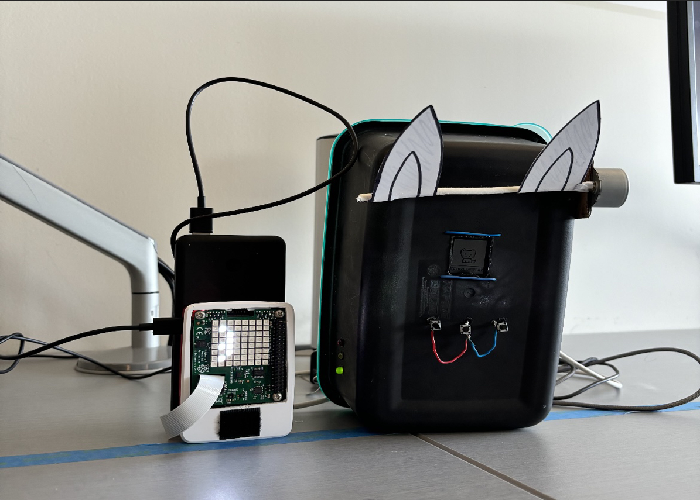

# Pixel Pet 

 

### Project Video: https://www.youtube.com/watch?v=4rg9wn9Kmdc&feature=youtu.be

### SYSC 3010 - Computer Systems Project Development 

#### TA: Oly Papillon 

### Authors: 

- #### Zakariya Khan 

- #### Jatin Jain 

- #### Riya Arora 

- #### Chanwoo Oh 

# Project Overview  

The `Pixel Pet` device addresses children's desire for pets and parental concerns about responsibility by providing a safe, educational, and interactive virtual pet experience. It provides a simulated pet experience using Raspberry Pis, buttons, screens, sensors, an IOS app, and SMS messaging. The device aims to educate children about pet ownership safely by offering interactive features like feeding, cleaning, playing, and walking the virtual pet. Children interact with the device through buttons and and LCD screen. The pet's mood is indicated by the angle of the ears which is controlled using a servo motor. A detachable and portable pedometer is used to record steps taken with the pet. Data is stored in a Firebase database, enabling real-time feedback and optimizing performance.Parents monitor their children's interactions and receive updates via an IOS app and SMS messaging. 

# Repository Overview 

Our repository includes Python programs for each node such as the mood indicator, LCD pet interface, pedometer, temperature and SMS module. There is a separate Python script that simplifies interfacing with Firebase used by each of the nodes. Swift code for the IOS app, unit testsand end-to-end testing scripts are all independently organized. 

# Directory Structure 

- `MyPixelPet-iOS-Application`: Contains the Swift code for the Pixel Pet IOS app. 

- `WeeklyUpdates`: Folder for weekly progress updates and reports. 

- `end_to_end_tests`: Scripts for end-to-end testing of the Pixel Pet functionalities. 

- `firebase`: Python script for Firebase interfacing for real-time data reads and writes. 

- `lcd_rpi`: Python program for LCD interfacing with Raspberry Pi. 

- `mood_indicator_rpi`: Python program for mood indicators based on sensor data. 

- `pedometer_rpi`: Python code for pedometer functionalities. 

- `sms_module`: Python script for SMS communication module. 

- `temp_sms_led_final`: Python script for temperature sensor and LED functionalities. 

- `temperature_rpi`: Python code for temperature sensor interfacing. 

- `unit_tests`: Unit tests for each component of the Pixel Pet system. 

# Installation Instructions 

To install and set up the Pixel Pet system, follow these steps: 

1. Clone this repository to your Raspberry Pi:   

`git clone https://github.com/SYSC3010-W24/sysc3010-project-l2-g2.git` 

2. Create a Python virtual environment:   

`python -m venv venv --system-site-packages` 

3. Activate the Python virtual environment:   

`source venv/bin/activate` 

4. Install Firebase Python module pyrebase:   

`python -m pip install pyrebase4` 

5. Install Adafruit's SharpMemoryDisplay Library:   
`pip3 install adafruit-circuitpython-sharpmemorydisplay` 

# Run Instructions 
Once you have installed and set up the necessary components, follow these instructions to run the Pixel Pet system: 

1. Open the terminal or command prompt. 
2. Navigate to the directory where the Pixel Pet repository is located. 
3. Execute the appropriate command based on the component you want to run. For example: 
- For running the lcd rpi run `python lcd_rpi/main_rpi.py`. 
- For testing the end-to-end functionalities, run the scripts in the `end_to_end_tests` directory. 

  

# Verifying Installation 

To verify that the installation and setup were successful, perform the following steps: 

1. Ensure that all dependencies and prerequisites are installed as specified in the installation instructions. 
2. Run unit tests or end-to-end tests to check the functionality of different components. 
3. Verify that each of the tests passes. 
